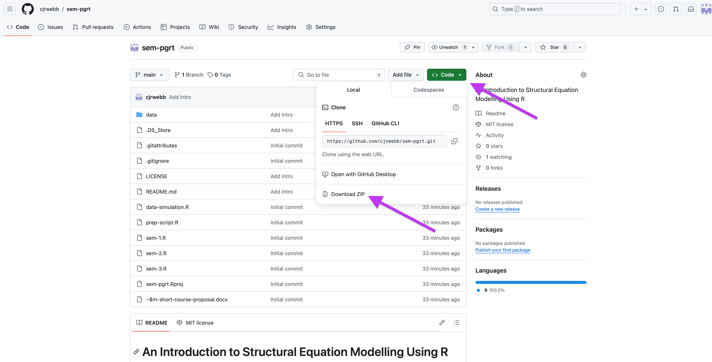
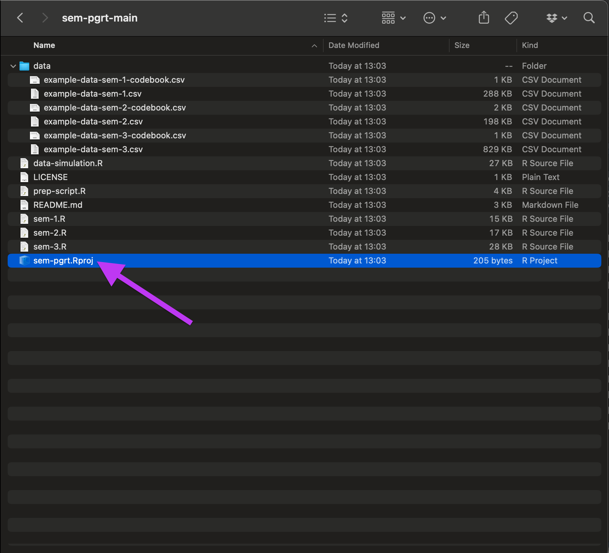
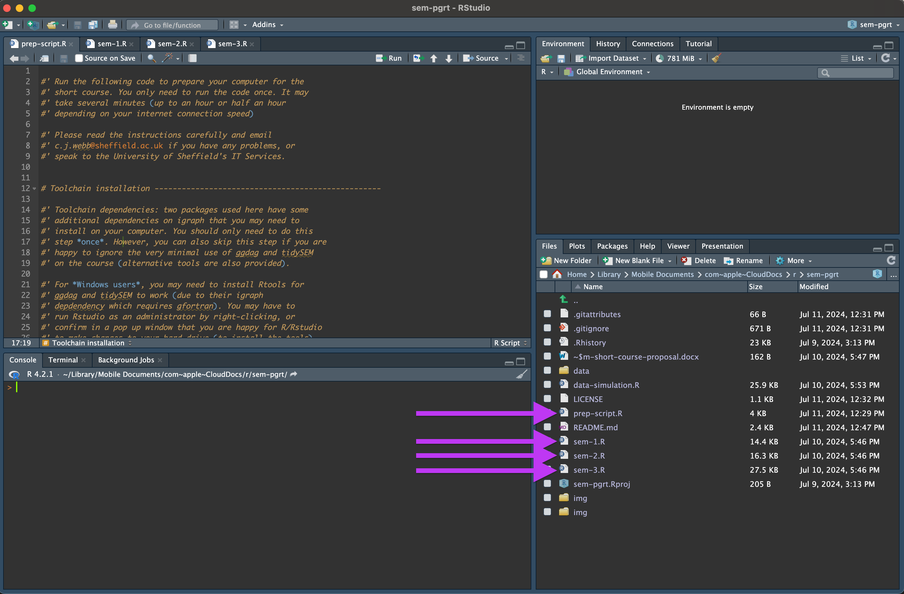
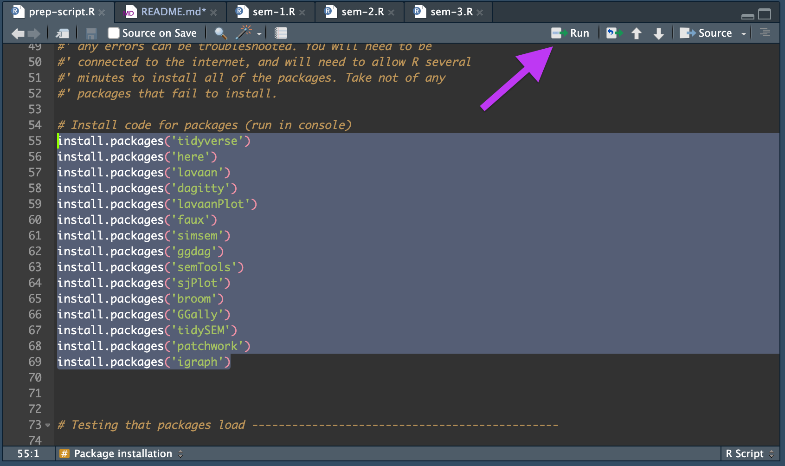
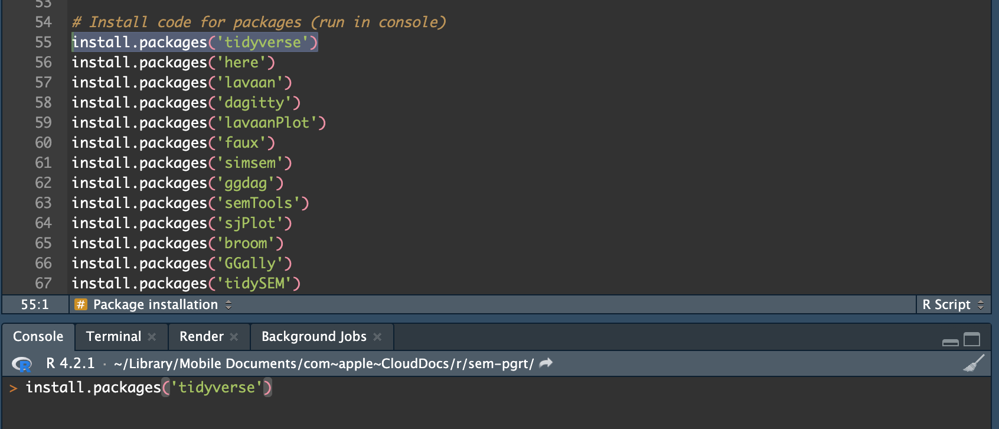

# An Introduction to Structural Equation Modelling Using R

#### Dr. Calum J. R. Webb, Sheffield Methods Institute, the University of Sheffield

This repository contains the course materials for the one day training course *'An Introduction to Structural Equation Modelling Using R'*, for postgraduate research students and research professionals. These materials should be downloaded prior to the start of the course, and the instructions in the `prep-script.R` file should be followed to ensure that your device is ready for the training course. Instructions are provided for computers running Windows, Mac, or Debian/Ubuntu systems. Other devices (iPhones, iPads, Android-based devices) are not suitable for the training course unless you also have access to an Rstudio server and can confidently configure an Rstudio server instance. 

The course is designed to be 'hands-on' to ensure that you are able to apply the statistical techniques and quantitative methods that are taught in a real research context.

If you are new to `R` and `Rstudio`, you will first need to install and configure the statistical programming language and the GUI on your device. 

Completing all of the setting up steps for the course should take no longer than an hour.

## Installing R and Rstudio

If you have never used R or Rstudio before, the first thing you will need to do is install both the programming language (`R`) and the GUI (graphical user interface, `Rstudio`). I recommend following [this guide from R for Data Science](https://r4ds.hadley.nz/intro#prerequisites). 

In short: 

1) First, go to [https://cloud.r-project.org](https://cloud.r-project.org), download and install the latest version of `R` for your operating system. If you do not know your computer's operating system (Windows, Mac, etc.), and if you're a Mac user and do not know whether you have an Intel-based or an Apple Silicon based Mac, I recommend speaking to your University IT Helpdesk. For students at the University of Sheffield, IT services information can be [found here](https://www.sheffield.ac.uk/it-services)

2) Next, go to [https://posit.co/download/rstudio-desktop/](https://posit.co/download/rstudio-desktop/), download and install the latest version of `Rstudio` for your operating system. 

3) Try opening `Rstudio`, **not R**, and see whether the screen you are greeted with looks like the one shown in [R for Data Science](https://r4ds.hadley.nz/intro#prerequisites). 

## Downloading a copy of the repository

This repository contains all of the data and code we will be using in the exercises throughout the short course. You will need to download a copy of the repository in advance.

1) At the top of this page ([https://github.com/cjrwebb/sem-pgrt](https://github.com/cjrwebb/sem-pgrt)), you should see a green button that says "Code" with a drop-down arrow. Click on the drop-down arrow, and then click "Download ZIP". You shouldn't need an account.

2) Next, unzip the zip folder and open it in your file viewer. For Mac users, you can just click on the zip file and MacOS will automatically unzip it in your downloads folder. You can then open the unzipped folder. For Windows users, you may need to find the zip folder in your downloads folder, right click it, and then click "Extract all...", or use the unzip option on the ribbon menu. For Ubuntu/Debian, you should be able to right click the file and select "Extract here".

3) Double-click the `sem-pgrt.Rproj` 'blue box' icon R project file to open the course R project in Rstudio.

{ width=50% }

4) In the bottom right panel (by default), make sure you are on the "Files" tab, then open the `prep-script.R` file by clicking on its name. This should open in the top left of your Rstudio window. You may also want to open up the three scripts we will be using through the course: `sem-1.R`, `sem-2.R`, and `sem-3.R`.

{ width=50% }

## Installing required packages and dependencies

We will make use of several libraries on the short course that should be installed **prior to the start of the course**. I would recommend trying to install them at least a few days before the start of the course so that you have some time to troubleshoot any problems, or to find out if the problems are likely to be very disruptive to your learning or not.

1) Navigate to the `prep-script.R` file that you opened in your RStudio window. **Carefully read** and follow all of the instructions to install required dependencies and packages.

2) If you are completely new to `R`, you should know that in order to run code you need to either:

  a) Highlight all of the code that you want to run and then click "Run" in the top right of the script pane (see image)

  { width=50% }

  
  b) **Or**, ensure your typing cursor (flashing vertical bar | ) is on the line of code, or that the code has been highlighted, and then press CMD+Enter (on Mac) or Ctrl+Enter (on Windows/Debian/Ubuntu) to run the code.
  
  c) **Or**, copy and paste the code from your script to your console (by default, in the bottom left of Rstudio), and then press Enter.
  

  
  { width=50% }
  

  
Once you have completed all of the steps in the `prep-script.R` file, you are ready for the course. You are welcome to explore the `sem-1.R`, `sem-2.R`, and `sem-3.R` scripts in advance of the course. 
  
  
   